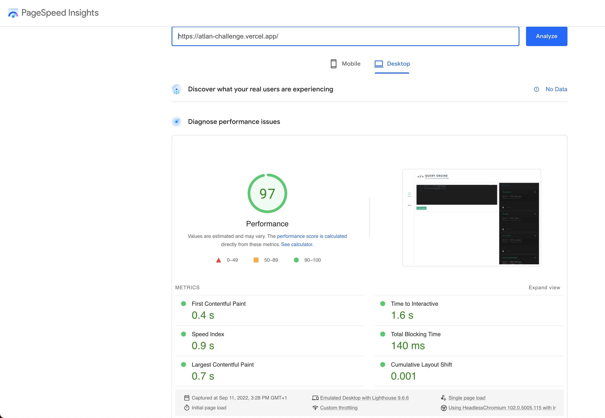

# Query for fun

## Demo

https://query-for-fun.vercel.app/

## Overview

**This is a dummy application.**

On this application you can run a set of queries to display dummy data stored on .csv files which have been linked to that query. You can choose from the queries on the right sidebar and run them either back clicking `►` or by typing them out directly in the IDE and pressing "Run query".

## Project Stack

Built using Vue 3, with Vite as the bundler, and Pinia for the state management.

IDE was created using the `@guolao/vue-monaco-editor`, a package that allows using Microsoft's monaco editor on a vue application, the very same editor used on VScode.

Prism.js was used for Highlighting queries on the right sidebar.

## Speed

Vue by default offers several features that makes an apps performant without much need for manual optimizations. Please see [Vue's documentation on performance](https://vuejs.org/guide/best-practices/performance.html).

## Insights

Page load time can bee seen bellow, calculated using Google PageSpeed Insights.



## Project Setup

```sh
npm install
```

### Compile and Hot-Reload for Development

```sh
npm run dev
```

### Compile and Minify for Production

```sh
npm run build
```

### Lint with [ESLint](https://eslint.org/)

```sh
npm run lint
```
